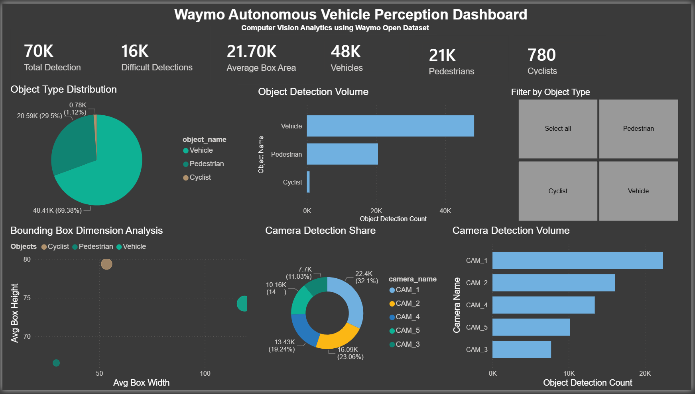
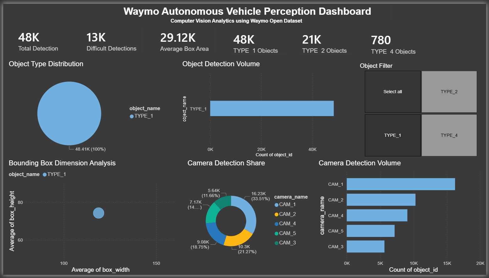

# Waymo Autonomous Vehicle Perception Dashboard

Computer Vision Analytics project using the Waymo Open Dataset, Python, Pandas, and Power BI.

---

## Dashboard Preview





---

## Project Overview

This project analyzes autonomous vehicle perception data from the Waymo Open Dataset.

The goal of this project was to explore object detection behavior across multiple vehicle cameras and build an interactive analytics dashboard for computer vision insights.

The workflow included:

- Parsing Waymo parquet files
- Cleaning and transforming perception data using Python
- Feature engineering with Pandas
- Exporting a master dataset to CSV
- Building an interactive Power BI dashboard

---

## Technologies Used

- Python
- Pandas
- Power BI
- Waymo Open Dataset
- GitHub

---

## Project Workflow

Waymo Open Dataset (Parquet Files)  
↓  
Python Data Cleaning & Feature Engineering  
↓  
CSV Export  
↓  
Power BI Dashboard Visualization

---

## Dashboard Features

### KPI Metrics
- Total detections
- Difficult detections
- Average bounding box area
- Detection counts by object type

### Visual Analytics
- Object type distribution
- Camera detection volume
- Camera detection share
- Bounding box dimension analysis

### Interactive Filtering
- Dynamic object filtering using slicers
- Cross-filtering across all visuals

---

## Key Insights

- TYPE_1 represented the majority of detections (~69%)
- CAM_1 generated the highest detection volume
- TYPE_4 objects appeared less frequently but showed larger average bounding box dimensions
- Difficult detections represented approximately 16K records

---

## Dataset Information

This project uses the Waymo Open Dataset for autonomous vehicle perception analytics.

Dataset Source:  
https://waymo.com/open/

---

## Skills Demonstrated

- Data Cleaning
- Feature Engineering
- Data Visualization
- Dashboard Design
- Computer Vision Analytics
- Autonomous Vehicle Data Analysis
- Exploratory Data Analysis (EDA)
- Python Scripting
- Power BI Reporting

---

## Repository Structure

```bash
dashboard/
images/
scripts/
README.md
requirements.txt
```

---

## Author

Jose Melgar

GitHub:  
https://github.com/jjanthonyma


